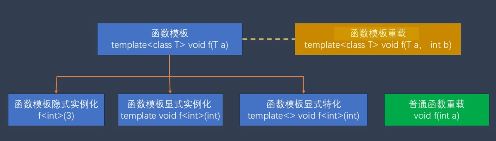

## 函数重载（Function Overloading）
函数重载：在同一作用域内，函数名相同，但**参数列表**不同，编译器能根据调用时的参数自动选择正确的函数。
参数列表不同，指以下任意一种（或组合）不同：
1.参数个数不同

2.参数类型不同

3.参数顺序不同

⚠️ 仅返回值不同不构成重载 仅参数名不同 —— 不构成重载 值传递时 const 不同 —— 不构成重载 默认参数 + 重载导致等价调用 —— 不构成合法重载

## 内联函数 inline
函数调用时会运行变快，内存占用增多  
选择：比较短小，经常使用的函数

以下情况不能作为内联函数：
函数中复杂控制语句如循环，switch等
函数中有静态变量
函数中存在递归调用

## 指针和引用
## 引用
& 出现在“类型声明里” → 引用
& 出现在“表达式里” → 取地址
类型层面：int& → 引用
表达式层面：&x → 取地址
## 常量引用
避免拷贝（性能）
防止误修改（安全）
## 指针和地址
new -> delete
常量指针
智能指针：#include <memory>  shared_ptr 智能指针自动管理动态分配的内存

## 类和对象 
类的声明
class 类对象{
        成员变量0；       //成员变量和函数之前没有写访问控制关键类默认 private
    public:             //公共类型
        成员变量1；
        成员函数2()；
    private:            //私有类型（只有自己的类可以访问）
        成员变量3：
        成员函数4();
    protected:          //自己的类和继承的类可以访问
        成员变量3；
        成员函数5（）；
}；
成员函数的定义：
内联方式：在类的声明中直接写出函数的定义
单独写出成员函数的定义：与普通函数类似：但在函数名称前需要添加一个类名加双冒号
通过类对象（实例）来调用类函数 .成员运算符
构造函数（可以重载） 默认生成无参数构造函数 还有拷贝构造函数（默认会生成，与期望不符合可以重定义 深拷贝和浅拷贝问题）
析构函数 只有一个不能带参数 在这个类对象被销毁之前需要执行一些操作 
通常在头文件中写类的申明 在cpp中写类的函数定义

## 类的继承和多态
class 派生类名称 继承方式 基类名称{}; 如果不是 public 继承，通常不该用继承
****
| 访问位置 \ 成员权限 | public | protected | private |
|:------------------|:------:|:---------:|:-------:|
| 类内部成员         | 可以访问 | 可以访问 | 可以访问 |
| 派生类成员         | 可以访问 | 可以访问 | 不可访问 |
| 类之外             | 可以访问 | 不可访问 | 不可访问 |

不能继承的成员：
- 构造函数/析构函数
- 运算符=（）成员
- 类的友元

会先调用基类的构造函数，在调用派生的构造函数
析构函数相反，先调用派生类的析构函数，在调用基类的析构函数

基类没有默认构造函数 → 派生类 必须显式初始化

初始化基类 只能用初始化列表

构造顺序：基类 → 派生类

析构顺序：派生类 → 基类
## 多态（Polymorphic））（还不太理解）
可以重写基类函数 virtual（虚函数）：告诉编译器：我就是要重写基类虚函数

- 基类的成员函数有虚函数
- 公有继承的派生类
- 派生类对这个虚函数进行了重写
- 使用基类的指针或引用指向派生类对象

纯虚函数和抽象类 ：需要纯虚函数的类叫做抽象类(接口类)
不能直接实例化抽象类，必须派生一个类，并重写纯虚函数，才能实例化这个派生类

## 类和对象：静态成员、友元、override与final, const函数
final:放在虚函数后让基类的虚函数在子类中不能被重写   放在类名后，那么这个类不能再被继承 （不是关键字可以用来作变量名）

| 关键字        | 作用       |
| ---------- | -------- |
| `virtual`  | 开启多态     |
| `override` | 保证你真的在重写 |
| `final`    | 终止继续重写   |
静态成员变量 
静态成员函数可以访问静态函数变量不能直接访问非静态变量，但可以通过类对象来访问

单例
const成员函数 不能修改成员变量 不能调用非const成员函数 不能通过const类型的对象调用非const成员函数
this指针
友元：被类“授权”访问其 private / protected 成员的外部函数或类。不会被继承
## 结构、联合、枚举
结构里如果是基本类型数组，或者是嵌套的这种结构，这样的结构是纯c语言的结构，他便可以直接作为二进制存储，读取，或者通过网络发送、接收
但如果包含非结构类型变量，如String类对象则不可以，但可以通过序类化转换
```bash
struct Head{
    unsigned int flag:1;
    unsigned int sig:1;
    unsigned int sn:4;
    unsigned int reserved:12;
    unsigned int crc:8;
};//可以将一个字节或者整形按照比特位分成几个部分，通常在面向底层的驱动程序以及通信程序中使用
```

## 联合 unino
## 枚举 enum
c++中引入有类的作用域的枚举 即enum class

## 运算符的重载(不太懂)
operator：把运算符变成函数名 
返回类型 operator 运算符(参数1，参数2)
类外的非函数重载
类的成员函数重载：
成员函数的重载
全局函数的重载

如<<
## 宏定义 #define 标识符 替换表达式（部分不清楚）
##是连接符
还有可变参的宏函数
## 函数模板 模板是 C++ 最强大的机制之一，STL、智能指针、Eigen、PCL、ROS 消息很多都靠它。
template = 类型的参数化（泛型编程）
模板不是运行时机制，是 编译期生成代码。
template<typename T>
返回类型 函数名(参数);
函数模板可以重载，也可以特例化template<>

## 类模板
如:
```bash
template<typename T>
class Vector3
{
    private:
        T m_vec[3];
    public:
        Vector3(T v1, T v2, T v3)
        {
            m_vec[0] = v1;
            m_vec[1] = v2;
            m_vec[2] = v3;
        }
};
Vector3<int> vec1(1,2,3);
Vector3<float> vec1(1.1,2.2,3.3);
```
类模板也可以特化，还可以部分特化
类模板的特化不能继承类模板的成员
## 命名空间
```bash
namespace 标识符
{

};
可以使用using namespace 编译指令直接使用命名空间的名称（可以全局使用，也可以函数内部使用）
```
## 异常
throw —— 抛出异常 throw 异常对象;
try —— 监控代码块 try{  // 可能出错}
catch —— 捕获异常 catch(类型 变量){// 处理}
对于动态分配的异常需要处理否则会造成资源泄漏 使用智能指针

## 类型转换
## 隐式转换
相互转换的类型是兼容的 比如基类转换派生类
转换构造函数（不太懂）
## 显式转换
## STL标准模板库：容器
常用容器
序列容器：按照顺序读取其中的元素
array
vector template < class T, class Alloc = allocator <T> > class vector;
deque
list

关联容器：通过键与值的映射来访问容器
map
set
