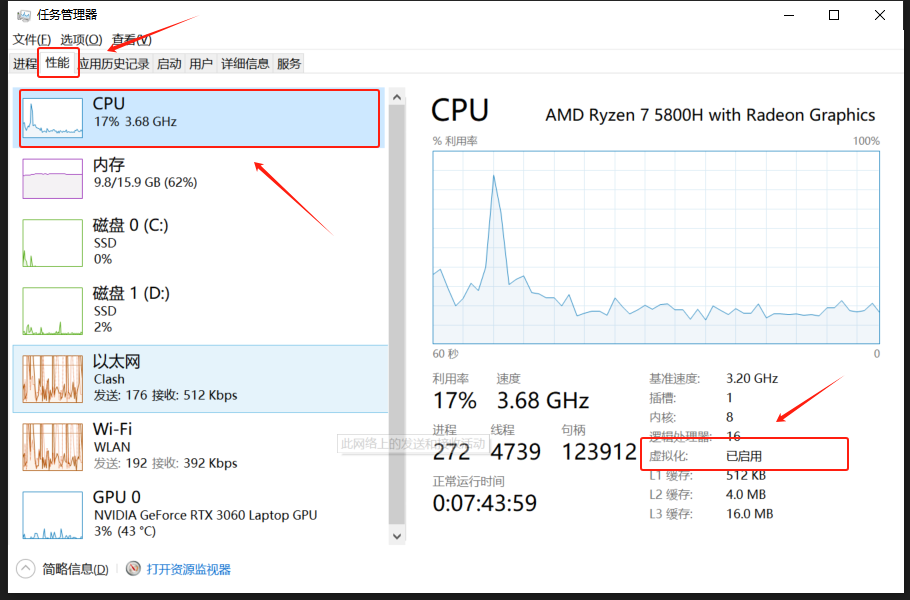
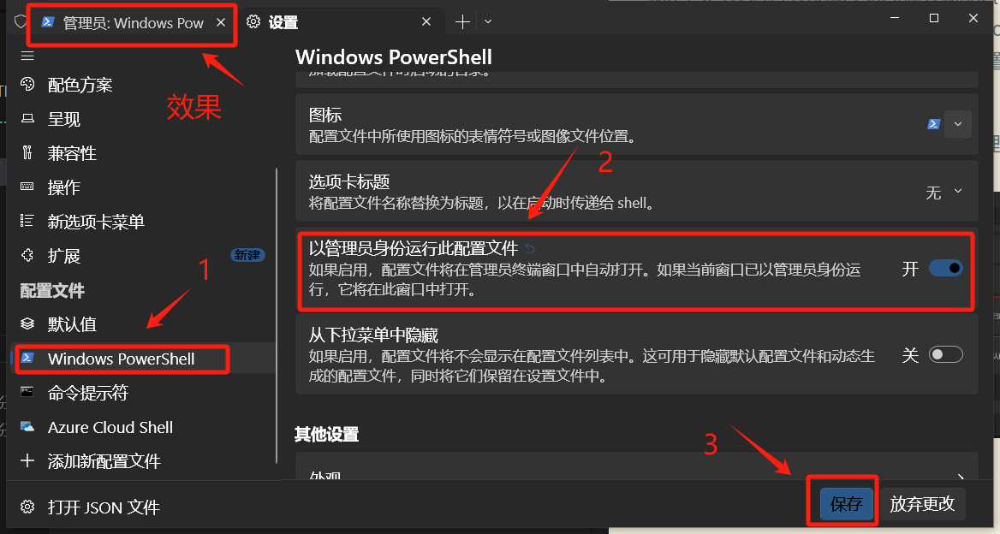

这篇文章把我自己安装 WSL2 时的零散笔记整理成了一套更顺手的流程，重点是先把环境装起来，再把常用检查项和命令留成备忘。

参考资料：

- [WSL 官方安装文档（Microsoft Learn）](https://learn.microsoft.com/zh-cn/windows/wsl/install)
- [安装参考视频](https://www.bilibili.com/video/BV1rHbdz2Ec1/)

## 安装前确认

使用 WSL2 之前，先确认这两个前提：

- Windows 版本满足 WSL2 要求。
- CPU 已开启虚拟化。

### 检查 CPU 虚拟化

按 `Win + X`，再打开任务管理器，在 CPU 信息里确认“虚拟化”是否已经启用。



如果这里显示未启用，通常需要进 BIOS 打开 Intel VT-x 或 AMD-V。

## 先装好 Windows Terminal

后面的大部分操作都建议放到 Windows Terminal 里完成，体验会比默认终端好很多。

在 PowerShell 中执行：

```powershell
winget install Microsoft.WindowsTerminal
```

常用打开方式：

- `Win + R` 后输入 `wt`
- 或者按 `Win + X` 后从终端入口打开

如果你需要更省事地执行安装类命令，可以把 Windows Terminal 设置成管理员启动。



## 安装 WSL2

最直接的方式是在 PowerShell 中执行：

```powershell
wsl --install
```

如果你想手动选择发行版，也可以先只安装 WSL：

```powershell
wsl --install --no-distribution
```

然后再单独安装 Ubuntu：

```powershell
wsl --install -d Ubuntu-20.04
```

> 不同系统环境下，发行版名称可能略有差异，安装前可以先用 `wsl --list --online` 查看可用发行版列表。

## 网络与代理

如果安装过程中网络不稳定，可以先让代理开启 TUN，或者在当前 PowerShell 会话里临时设置代理：

```powershell
$env:https_proxy="http://127.0.0.1:7890"
$env:http_proxy="http://127.0.0.1:7890"
```

安装完成后，如果想清掉当前终端里的代理变量，可以执行：

```powershell
Remove-Item Env:\https_proxy
Remove-Item Env:\http_proxy
```

如果你需要让 Windows 和 WSL 共用网络代理，通常会遇到两种模式：

- `NAT`：更常见，某些场景下需要手动处理局域网代理端口。
- `Mirrored`：配置体验通常更直接，但并不是所有系统版本都支持。

## 安装完成后怎么确认是否正常

先看当前 WSL 状态：

```powershell
wsl --status
```

如果结果里能看到默认版本为 `2`，通常说明 WSL2 已经正常启用。

再查看当前已安装的发行版：

```powershell
wsl -l -v
```

这个命令会列出：

- 已安装的 Linux 发行版
- 当前运行状态
- 对应的 WSL 版本

## 常用管理命令

### 设置默认发行版

```powershell
wsl -s Ubuntu-20.04
```

### 删除某个发行版

```powershell
wsl --unregister Ubuntu #在window下执行
```

删除前先用 `wsl -l -v` 看清楚当前发行版名称，避免删错。

## Windows 和 WSL 的文件互通

在 WSL 里，`/mnt` 是访问 Windows 磁盘的入口目录。

例如：

- `C:` 盘通常会挂载到 `/mnt/c`
- `D:` 盘通常会挂载到 `/mnt/d`


这意味着你可以直接在 WSL 中访问 Windows 文件，也可以在 Windows 编辑器里操作 WSL 项目文件。但从性能和权限角度看，开发项目通常更适合放在 Linux 文件系统内部，而不是长期直接放在 `/mnt/c` 下面。

## 我自己的安装建议

- 先检查虚拟化，再安装 WSL，不要一上来就反复重试命令。
- 优先用 Windows Terminal 管理 PowerShell、CMD 和 WSL 会话。
- 网络有问题时先排查代理，不要误以为是 WSL 本身安装失败。
- 装完后第一时间执行 `wsl --status` 和 `wsl -l -v`，确认版本和发行版状态。

## 补充

后续如果要继续在 WSL 里装 Docker、Git、Node.js 或搭建 C/C++ 开发环境，可以在这篇基础上继续往下扩展。

补充阅读：

- [一文看懂 WSL 的目录与文件互通](https://zhuanlan.zhihu.com/p/57630633)
