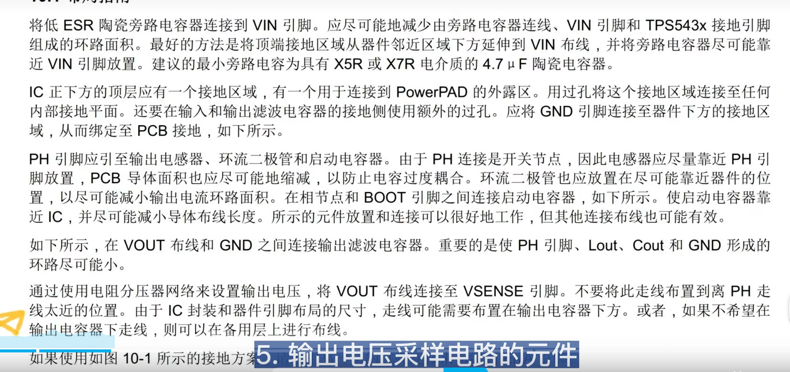

1. 输入电容要靠近VIN管脚
2. 电感要尽量靠近PH管脚
3. 续流二极管和启动电容要尽可能靠近IC
4. PH到电感，到输出电容，在到地的回路要尽可能的小
5. 输出电压采样电路的元件走线要远离PH部分
6. GND管脚与芯片下方的地连接
7. IC下方铺铜接地，连接IC底部的散热管脚，并用过孔连接到内部的接地平面
8. 输入输出电容接地一侧加额外过孔
9. 要保留电感下方隔层的GND覆铜，也可以打孔

