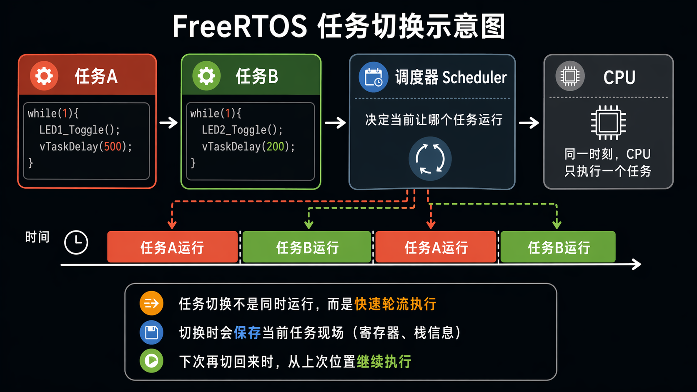

FreeRTOS (Real Time Operating System 实时操作系统)
- CPU计算资源调度
- 内存空间的分配
- 对于嵌入式而言其实更注重它的任务解耦能力

[FreeRTOS](https://www.freertos.org/zh-cn-cmn-s/)

PC寄存器和时间片
队列，信号量、互斥锁、直达任务通知等工具
还有软件定时器，内存管理等机制

开发stm32的三种方式
STM32CubeIDE
Stm32CubeIDE + Keil
Stm32CubeIDE + cmake(vscode/Clion)

FreeRTOS Interface 选项笔记
1. Disable
直接使用 原生 FreeRTOS API
常见函数：xTaskCreate、vTaskDelay
适合入门学习和自己做项目
1. CMSIS_V1
使用 CMSIS-RTOS V1 接口
常见函数：osThreadCreate、osDelay
属于 较老版本接口
适合老工程兼容
1. CMSIS_V2
使用 CMSIS-RTOS V2 接口
常见函数：osThreadNew、osDelay
比 V1 更新、更规范
适合新工程使用
一句话总结
Disable：直接用 FreeRTOS 原生接口
CMSIS_V1：老版 CMSIS 接口
CMSIS_V2：新版 CMSIS 接口

**CMSIS-RTOS，是为了统一不同 RTOS 的调用接口**

线程（Thread） = 任务（Task）
----cmsis-os     = freeertos

程序计数寄存器 : PC寄存器
程序被烧录到flash中 PC寄存器就存储着cpu将要执行的指令所在的FLASH地址
