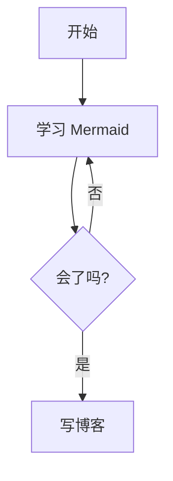
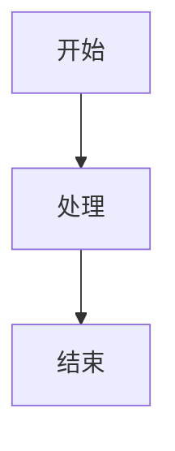

## 常用 Markdown
### 标题
Markdown 使用 `#` 表示标题层级。
```md
## 这是一个二级标题（H2）

### 这是一个三级标题（H3）

#### 这是一个四级标题（H4）

##### 这是一个五级标题（H5）

###### 这是一个六级标题（H6）
```

### 分割线（Horizontal Rules）
使用三个或以上 - 或 * 创建分割线。

```md
***
---
```
效果：

***

---

### 强调（Emphasis）

Markdown 支持加粗、斜体和删除线。

```md
**这是加粗文本**  *这是斜体文本*  ~~这是删除线~~
```
效果：
**这是加粗文本**  *这是斜体文本*  ~~这是删除线~~

### 块引用（Blockquotes）
使用 > 表示引用内容。
```md
> 块引用也可以嵌套...
>
> > ...通过在前面继续添加 `>` 符号
```
效果：
> 块引用也可以嵌套...
>
> > ...通过在前面继续添加 `>` 符号

### 脚注（References）
脚注可以用于补充说明。

```md
这是一个包含可点击脚注的示例[^1]。

这是第二个包含脚注的示例[^2]。

[^1]: 第一个脚注示例，点击可以返回正文。
[^2]: 第二个脚注示例。
```
效果：
这是一个包含可点击脚注的示例[^1]。

这是第二个包含脚注的示例[^2]。

[^1]: 第一个脚注示例，点击可以返回正文。
[^2]: 第二个脚注示例。


~~如果你查看 `src/content/blog/markdown-elements.md`，你会发现脚注以及“Footnotes”标题是通过  
[remark-rehype](https://github.com/remarkjs/remark-rehype#options) 插件自动添加到页面底部的。~~

### 列表（Lists）

**无序列表：**

- 可以使用 `+`、`-` 或 `*` 开头
- 子列表通过缩进 2 个空格创建：
  - 符号变化会强制开启新列表：
    - 示例一
    - 示例二
    - 示例三
- 非常简单！

**有序列表：**

1. 第一项
2. 第二项
3. 第三项

4. 你可以继续用递增数字
5. 或者全部写成 `1.` 也可以

从指定数字开始：

57. 第一项
1. 第二项

### 代码（Code）

**1. 行内代码：** `code`

**2. 缩进代码块：** 用 **4 个空格缩进**形成代码块

    // 一些注释
    这是第一行代码
    这是第二行代码
    这是第三行代码

**3. 代码块**（围栏形式）：用 ``` 包住代码

```
此处为实例文本
```
语法高亮：在 ``` 后面写语言，比如 `js`、`python`，代码会自动上色

**4. 语法高亮**

```js
var foo = function (bar) {
	return bar++;
};

console.log(foo(5));
```
#### 更具表达性的代码示例
1. 添加标题
```js title="file.js"
console.log("Title example");
```
2. 一个 Bash 终端示例
```bash
echo "A base terminal example"
```
3. 高亮代码行
```js title="line-markers.js" del={2} ins={3-4} {6}
function demo() {
	console.log("this line is marked as deleted");
	// This line and the next one are marked as inserted
	console.log("this is the second inserted line");

	return "this line uses the neutral default marker type";
}
```

[Expressive Code](https://expressive-code.com/) 的功能远不止这里展示的这些，并且提供了大量的 [自定义配置](https://expressive-code.com/reference/configuration/)。

### 表格与图片
```md
图片格式：
```
示例：

1. 基本表格写法（表格里可以写 Markdown）

| 项目 | 说明        | 示例      |
| ---- | ----------- | --------- |
| 标题 | # 标题      | # Title   |
| 加粗 | **文本**    | **bold**  |
| 代码 | `code`      | `print()` |
| 链接 | [text](url) | Google    |


2. 列对齐方式
  对齐规则：:--- → 左对齐 :---: → 居中 ---: → 右对齐
  示例
  
| 左对齐 | 居中  | 右对齐 |
| :----- | :---: | -----: |
| 内容A  | 内容B |  内容C |
| 文本1  | 文本2 |  文本3 |

### 一些常用标识符
⭐ 大标题
📌 重点
💡 方法
⚠ 易错
🔥 必背

### 链接

[来自 markdown-it](https://markdown-it.github.io/)

## 扩展 Markdown
### 支持 Remixicon 图标

```text
:i{class="ri-poker-hearts-fill"}
:i{class="ri-poker-clubs-fill"}
```

:i{class="ri-poker-hearts-fill"}
:i{class="ri-poker-clubs-fill"}

### 支持按钮

```text
:btn[Google]{href="https://www.google.com"}
```

:btn[Google]{href="https://www.google.com"}

```text
:::btn{href="#"}
:i{class="ri-share-box-line"} Open in new tab
:::
```

:::btn{href="#"}
:i{class="ri-share-box-line"} Open in new tab
:::

### 支持 GitHub 仓库卡片

```text
::github{repo="用户名/仓库名"}
```
例子：
::github{repo="cirry/astro-yi"}

### 支持折叠块

```md
:::collapse
文本
:::
```

:::collapse
Hello World!
:::

```md
<details>
<summary>点击展开</summary>
文本
</details>
```
<details>
<summary>点击展开</summary>
文本
</details>


### 支持提示块

```markdown
:::tip[标题]
自定义标题
:::

:::note
注意
:::

:::caution
警告
:::

:::danger
危险
:::

```

:::tip[标题]
自定义标题
:::

:::note
注意

```js
console.log('hello world')
```

:::

:::caution
警告
:::

:::danger
危险
:::

### 支持 Mermaid 图表

使用方法：

+ 代码块以 **` ```mermaid `** 开始
+ 以 **` ``` `** 结束
+ 在 Frontmatter 中启用 **`mermaid: true`**

Mermaid 代码示例：

```md title="mermaid.md"

flowchart TD
  A[开始] --> B[学习 Mermaid]
  B --> C{会了吗?}
  C -- 是 --> D[写博客]
  C -- 否 --> B

```

渲染结果：


### 支持 MathJax 数学公式

+ 请在 Frontmatter 中设置：`mathjax: true`。

### 块级公式模式

```yaml title="Mathjax.md"
---
mathjax: true
---
hello!
$$ \sum_{i=0}^N\int_{a}^{b}g(t,i)\text{d}t $$
hello!
```

hello!
$$ \sum_{i=0}^N\int_{a}^{b}g(t,i)\text{d}t $$
hello!

### 行内公式模式

```yaml title="Mathjax.md"
---
mathjax: true
---
hello! $ \sum_{i=0}^N\int_{a}^{b}g(t,i)\text{d}t $ hello!
```

hello! $ \sum_{i=0}^N\int_{a}^{b}g(t,i)\text{d}t $ hello!

## VS Code 插件用法
### 快捷键
ctrl + B 快捷加粗

## 可复制模板

下面是一份可直接新建文章使用的模板：

````md
---
title: "文章标题"
description: "一句话描述这篇文章讲什么"
date: 2026-03-05
lastModified: 2026-03-05
category: [分类1, 分类2]
tags: [标签1, 标签2]
toc: true
mermaid: false
mathjax: false
draft: false
sticky: 0
series: "系列名"
seriesOrder: 1

---

## 一、前言

这篇文章将介绍什么问题、适合谁阅读，以及读完后你能得到什么。

## 二、核心内容

### 1. 背景

先解释问题背景与使用场景。

### 2. 实现步骤

1. 第一步做什么
2. 第二步做什么
3. 第三步做什么

### 3. 示例代码

```js
function greet(name) {
  return `Hello, ${name}!`;
}

console.log(greet("Astro"));
```

### 4. 示例图表（可选）



## 三、总结

总结关键结论、常见坑和下一步建议。
````
