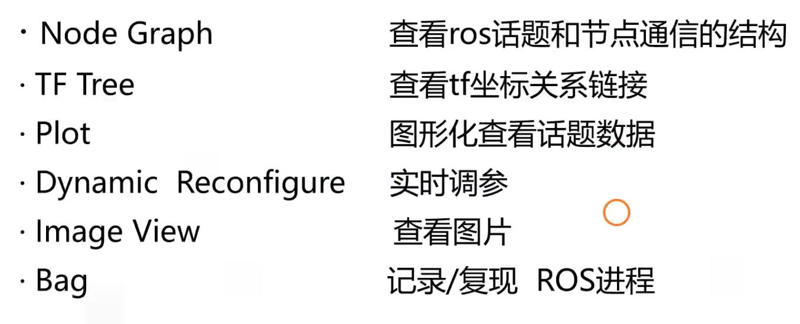
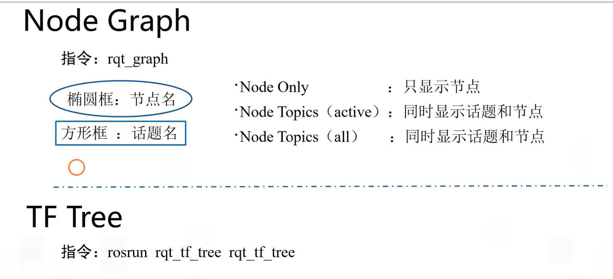
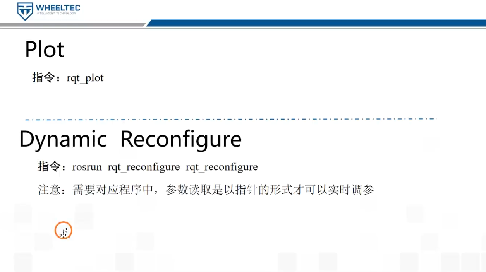
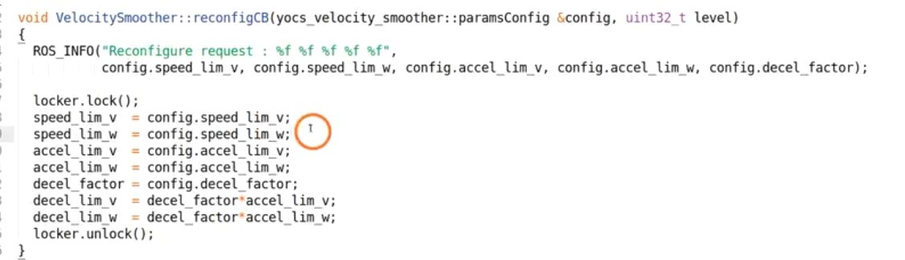
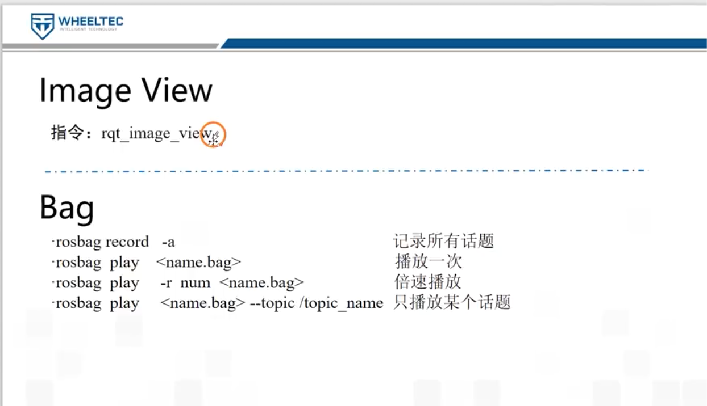
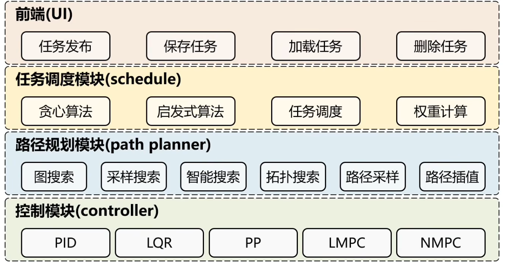

title: "mid360差速车笔记"
description: "mid360差速车笔记"
date: 2026-03-11
lastModified: 2026-03-11
category: [ROS]
tags: [ROS, 差速车]
comment: true
slug: "custom-slug"

map：全局地图坐标系
camera_init：SLAM/里程计参考层
body：机器人本体

map 先验地图的坐标系（固定不动）
camera_init LAM 建图时的初始雷达位置（也称里程计坐标系） **相当与odom**
map_to_caminit 节点的作用就是：

发布 camera_init（里程计坐标系）相对于 map（全局地图坐标系）的相对位置和姿态。

指令：rosrun tf2_tools view_frames.py生成坐标系图
rosrun rqt_tf_tree rqt_tf_tree
view_frames.py：生成静态的 frames.pdf 文件，展示坐标系之间的变换关系。

body 是机器人真实本体坐标系，body_2d 是把它“压平到二维导航平面”后的坐标系。

body_2d

是从 body 派生出来的“二维导航专用坐标系”
保留 x / y / yaw
去掉 roll / pitch
一般也不关心真实高度变化
适合 2D 局部地图、2D 路径跟踪、平面导航控制
在这个工程里由 pc_to_elevation.cpp (line 224) 根据 map -> body 计算后再发布 map -> body_2d

纯 2D 仿真：body
实机平面导航：通常也先 body
启用高程图/3D 投影导航：再考虑 body_2d

rosrun rqt_graph rqt_graph 查看话题之间的关系
直接rqt_graph
一般隐藏显示Debug和tF
Node Only：只关注节点本身，不涉及话题。

Node Topics (active)节点主题（：查看节点当前活动的话题。

Node Topics (all)节点主题（全部）：查看节点所有话题（包括未使用的）。
二，打开rqt工具集
先关闭rqt在关闭rqt工具集，否则下一次打开就默认是上一次的rqt工具集

## TF_Tree
rqt_tf_tree：提供图形化界面，动态显示 TF 树，便于交互式查看和调试坐标系之间的关系。
## 图形化的查看话题数据 plot工具

## Dynamic Reconfigure工具
实时调参有三步
首先首先创建.cfg文件 .cfg文件是在插件显示可调参数的名称如下图所是

第二步是在程序中创建服务节点来完成参数的动态配置如图

第三步添加编译规则

image View(查看ros消息格式的图片)
指令：rqt_image_view

## bag (录制和复现ros进程)

sa
建议的目标分层

vendor/：livox_ros_driver2、fast_lio_exp 这类第三方包，单独管理。
perception_localization/：雷达驱动、SLAM、重定位、地图预处理。
navigation_core/：图加载、全局规划、局部控制、导航接口消息。
hardware/：serial_comm_pkg 或 chassis_driver_pkg，专门管底盘协议和状态。
decision/：任务队列、状态机/行为树、恢复逻辑。
interfaces/：web_interface_pkg、手柄控制、上位机接口。
bringup/：simulation_bringup、real_bringup、system_bringup，只负责装配，不写业务。

清掉 move_base 配置噪声
先修 local_costmap_params.yaml 和 costmap_common_params.yaml：
去掉旧式 map_type
把 local_costmap.plugins 放进 local_costmap: 命名空间
目标是启动时没有那两条 costmap warning。
固定纯仿真入口
把 simulation_movebase.launch 明确成唯一仿真入口，只保留：
navigation_simulate.py
navigation_movebase.launch
rviz
不要默认启 agv_nav_task、launch_map_trans、fast_lio。
把 my_planner 收成稳定组件
继续整理 my_planner.cpp：
frame 依赖统一成 body 或做成参数
去掉纯调试输出
到点停稳
异常时安全返回
目标是“不会崩、行为可预测”。
写一份最小回归清单
验证这几项：
连续发多个 goal 正常
2D Pose Estimate 后还能继续导航
到终点不残留速度
重启 launch 后行为一致
再做架构分层落地
等上面稳定后，再拆：
simulation
navigation-core
map-tools
task-layer
localization
hardware
如果只选一个立刻动手的任务，我建议现在先做第 1 步：把 costmap 参数修干净。

| 日志级别            | 描述                                  | 适用场景                 | 输出颜色 |
| --------------- | ----------------------------------- | -------------------- | ---- |
| **`ROS_DEBUG`** | 用于输出 **调试信息**，通常用于开发和调试阶段。          | 追踪程序流程、输出变量值、调试代码    | 白色   |
| **`ROS_INFO`**  | 用于输出 **信息性日志**，表示程序的正常运行状态。         | 报告正常进程、状态更新或重要的信息    | 白色   |
| **`ROS_WARN`**  | 用于输出 **警告信息**，表示程序遇到了潜在问题或不理想的情况。   | 提醒开发者注意可能影响系统的问题     | 黄色   |
| **`ROS_ERROR`** | 用于输出 **错误信息**，表示程序发生了错误。            | 报告严重但可恢复的错误，例如资源不可用  | 红色   |
| **`ROS_FATAL`** | 用于输出 **致命错误信息**，表示程序发生了严重错误，无法继续执行。 | 报告致命错误，通常导致程序崩溃或停止运行 | 红色   |

节点没有设置 output="screen"，所以它自己的 ROS_INFO 默认不会出现在你当前终端里，而是进日志文件。

导航 Client 节点 <-Action-> move_base
 Client                    Server
 1.编写节点代码
 2.设置编译规则
 3.编译节点文件
 4.运行节点文件

 //两两之间直线插值