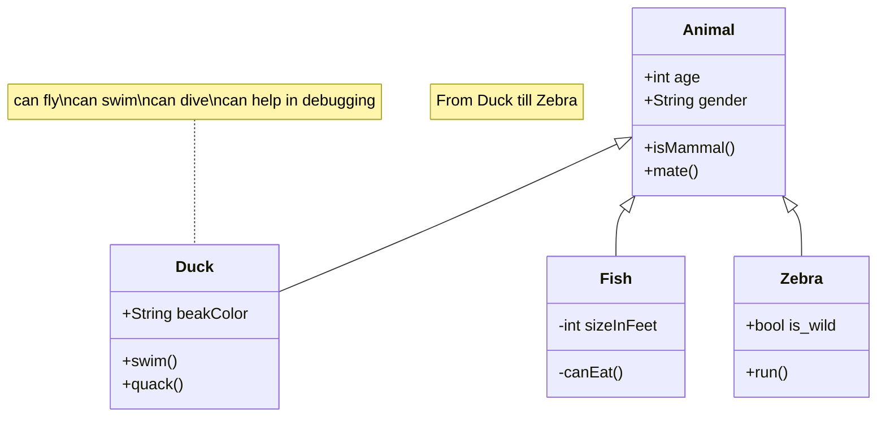

### 支持 Remixicon 图标

```text
:i{class="ri-poker-hearts-fill"}
:i{class="ri-poker-clubs-fill"}
```

:i{class="ri-poker-hearts-fill"}
:i{class="ri-poker-clubs-fill"}

### 支持按钮

```text
:btn[Google]{href="https://www.google.com"}
```

:btn[Google]{href="https://www.google.com"}

```text
:::btn{href="#"}
:i{class="ri-share-box-line"} Open in new tab
:::
```

:::btn{href="#"}
:i{class="ri-share-box-line"} Open in new tab
:::

### 支持Github仓库卡片

```text
::github{repo="cirry/astro-yi"}
```

::github{repo="cirry/astro-yi"}

### 支持折叠块

```bash
:::collapse
Hello World!
:::
```

:::collapse
Hello World!
:::

### 支持提示块

```markdown
:::tip[Customized Title]
hello world
:::

:::note
note
:::

:::caution
caution
:::

:::danger
danger
:::

```

:::tip[Customized Title]
hello world
:::

:::note
note

```js
console.log('hello world')
```

:::

:::caution
caution
:::

:::danger
danger
:::

### 支持 mermaid 图表

使用方法:

+ 代码块以 **```mermaid**开始
+ 以 **```**结束
+ Frontmatter 中需启用 `mermaid: true`.

Mermaid 代码示例:

```html title="mermaid.md"
classDiagram
note "From Duck till Zebra"
Animal <|-- Duck
note for Duck "can fly\ncan swim\ncan dive\ncan help in debugging"
Animal <|-- Fish
Animal <|-- Zebra
Animal : +int age
Animal : +String gender
Animal: +isMammal()
Animal: +mate()
class Duck{
+String beakColor
+swim()
+quack()
}
class Fish{
-int sizeInFeet
-canEat()
}
class Zebra{
+bool is_wild
+run()
}
```

渲染结果:



### 支持 mathjax 数学公式

+ 请在 Frontmatter 中设置：`mathjax: true`.

#### 块级公式模式

```yaml title="Mathjax.md"
---
mathjax: true
---
hello!
$$ \sum_{i=0}^N\int_{a}^{b}g(t,i)\text{d}t $$
hello!
```

hello!
$$ \sum_{i=0}^N\int_{a}^{b}g(t,i)\text{d}t $$
hello!

#### 行内公式模式

```yaml title="Mathjax.md"
---
mathjax: true
---
hello! $ \sum_{i=0}^N\int_{a}^{b}g(t,i)\text{d}t $ hello!
```

hello! $ \sum_{i=0}^N\int_{a}^{b}g(t,i)\text{d}t $ hello!

### 与 Expressive Code 高级代码高亮集成

更多用法请参考官方文档： [expressive-code](https://expressive-code.com/).

```js title="line-markers.js" del={2} ins={3-4} {6}
function demo() {
  console.log('this line is marked as deleted')
  // This line and the next one are marked as inserted
  console.log('this is the second inserted line')

  return 'this line uses the neutral default marker type'
}
```

### 默认支持代码折叠

```js
var myArr = [1, 2]
console.log(myArr)

var myObj = {a: 1, b: 2}

for (let key of myArr) {
  console.log(key)
}

var it = myArr[Symbol.iterator]()
it.next() // {value: 1, done: false}

// VM704:12 Uncaught TypeError: myObj is not iterable
for (let key of myObj) {
  console.log(key)
}

```
