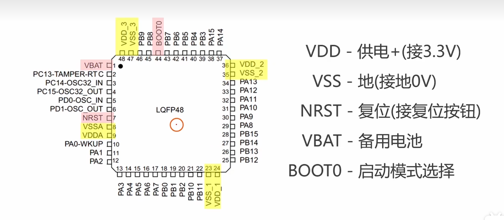
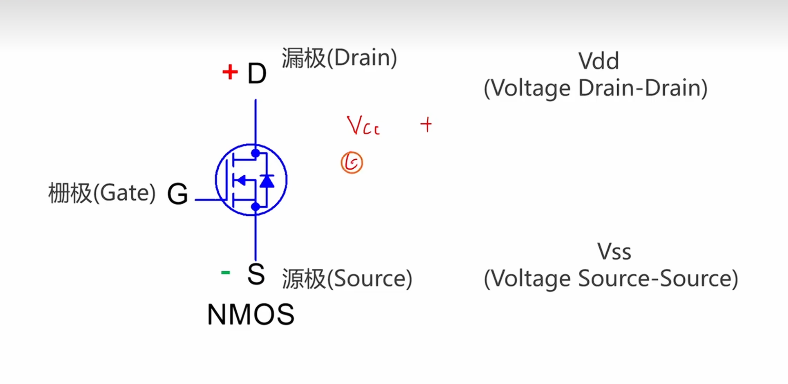
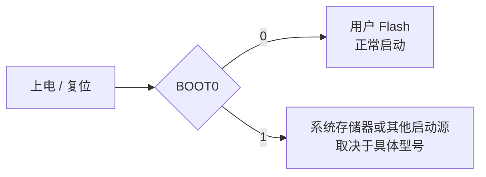
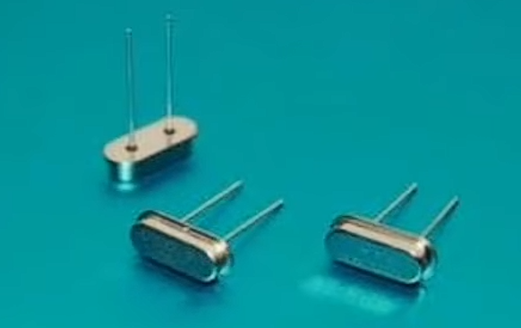
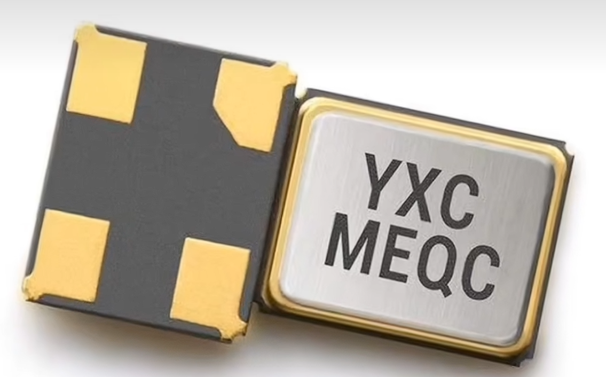
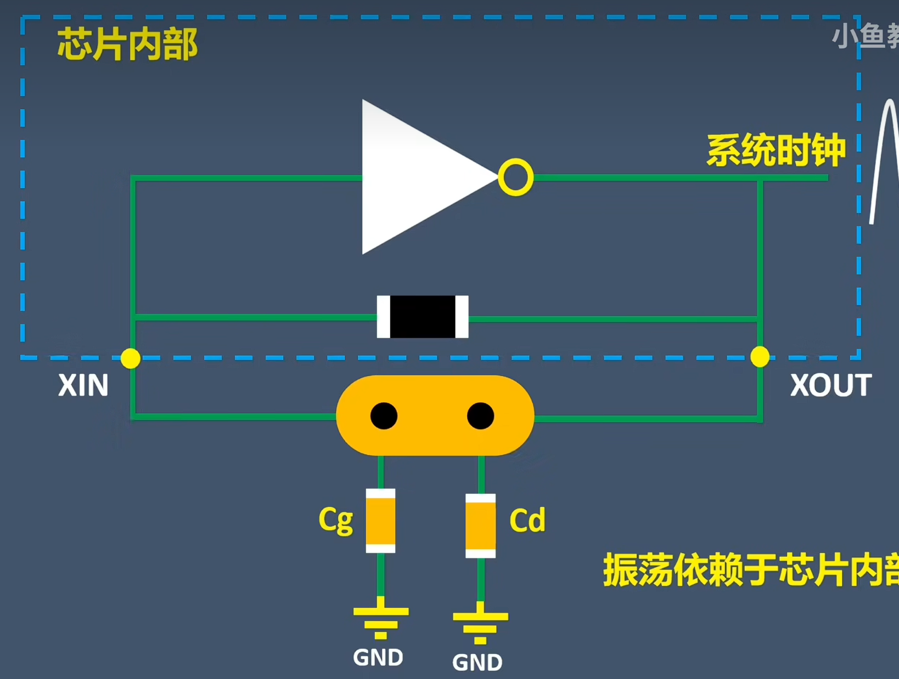
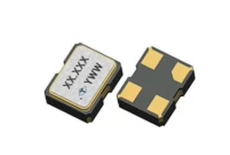
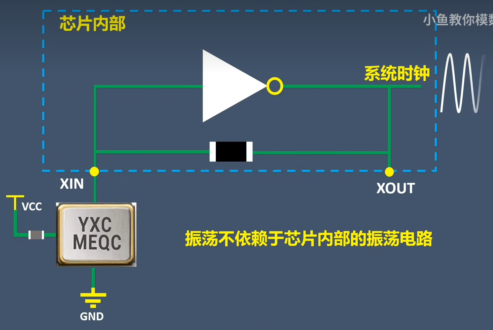

这篇不是完整教程，更像一份做 STM32 硬件时会反复翻的设计备忘。内容主要覆盖四块：启动模式、时钟电路、调试下载接口，以及几个常见的外围硬件注意点。

## 1. 启动模式与 BOOT0

STM32 上电或复位后，会根据启动配置决定代码从哪里开始执行。大多数项目里，核心目标都很简单：默认从用户 Flash 启动，只有下载或救砖时才切到系统 Bootloader。






### 推荐接法

最常见的接法是把 `BOOT0` 通过一个电阻下拉到 GND：

```text
BOOT0 -> 10kΩ -> GND
```

这样默认就是正常启动用户程序。需要进入下载模式时，再临时把 `BOOT0` 拉高到 `3.3V`，复位后进入系统 Bootloader。

### 设计时要注意

- 大多数板子都应该让 `BOOT0` 默认下拉，避免上电误入下载模式。
- 如果板子后续可能需要串口下载或救砖，最好预留 `BOOT0` 测试点、跳帽或拨码开关。
- 不同 STM32 系列的启动映射并不完全一致，具体还是要看对应型号的数据手册和参考手册。

:::note
简单记忆：`BOOT0 = 0` 通常是正常启动，`BOOT0 = 1` 通常用于下载或特殊启动。
:::

## 2. 晶振与时钟电路

STM32 常见的外部时钟方案有两类：无源晶振和有源晶振。它们的接法、外围器件和布局重点并不一样。

### 无源晶振

无源晶振本身不主动输出时钟，依赖 MCU 内部振荡电路与外部负载电容共同工作。





特点：

- 成本通常更低。
- 外围设计更依赖负载电容和布局质量。
- 频率精度会受到杂散电容和布线方式影响。

### 有源晶振

有源晶振内部自带振荡电路，需要供电，输出的是已经成形的时钟信号。




特点：

- 外围电路更简单。
- 对 MCU 内部振荡单元依赖更少。
- 成本通常高于无源晶振。

### 晶振布局要点

- 晶振要尽量靠近 MCU 时钟引脚。
- 两根时钟线尽量短、尽量等长，不要绕远。
- 晶振下方和周边避免有高速信号穿过。
- 底部铺铜通常要谨慎处理，很多场景下会选择挖空以减小寄生电容。
- 晶振金属外壳如果封装支持，通常建议良好接地。

:::caution
时钟电路最怕“原理图没问题，布局一团糟”。晶振相关问题往往不是器件坏，而是距离太远、回路太大、下方走了别的高速线。
:::

## 3. SWD 调试接口

STM32 最常用的下载和调试接口是 SWD。最基础的信号通常包括：

- `SWDIO`
- `SWCLK`
- `NRST`
- `3.3V`
- `GND`

### 一个常见的原理图思路

```text
SWDIO -- 22Ω -- MCU
SWCLK -- 22Ω -- MCU
NRST  -- 10kΩ 上拉到 3.3V
```

设计时可以注意这几点：

- `SWDIO` 和 `SWCLK` 串小电阻是常见做法，`22Ω` 是常见起点，但不是绝对值。
- `NRST` 一般建议稳定上拉，并预留调试口复位控制。
- 如果接口对外、线缆较长或环境较差，可以考虑加低电容 TVS 做 ESD 防护。
- 调试接口尽量离 MCU 不要太远，避免信号边沿被额外干扰。

## 4. USB 与 Type-C 常见细节

如果 STM32 板子带 USB，下面这些点通常会反复遇到。

### USB D+ / D-

- `USB_DP` 和 `USB_DM` 串联小电阻是常见做法，`22Ω` 很常见。
- 这个阻值主要用于改善信号完整性，最终还是要参考芯片参考设计和实际阻抗控制。
- 差分线要成对走线，尽量保持长度匹配和参考平面连续。

### Type-C 的 CC1 / CC2

- 如果你的板子是受电设备（Sink），通常需要在 `CC1`、`CC2` 上接下拉电阻 `Rd`。
- 如果你的板子是供电设备（Source），则需要相应的上拉配置 `Rp`。
- 不要把“CC 上拉/下拉”当成记忆口诀直接套，先明确自己是取电还是供电角色。

## 5. MOS 管选型里最容易看错的参数

做电源开关、负载控制时，很多人第一次选 MOS 管都会被参数表误导，尤其是 `Vgs(th)`。

### 重点先记住

- `Vgs(th)` 是“刚开始导通”的门槛，不是“完全导通”的驱动电压。
- 真正决定导通损耗的，通常要看目标驱动电压下的 `Rds(on)`。
- 栅极相关电容越大，开关速度和驱动难度通常也越高。

### 选型时优先看什么

- 在你的实际驱动电压下，`Rds(on)` 是否足够低。
- 电流、功耗和封装散热是否满足要求。
- `Qg`、`Ciss`、`Cgs` 等参数是否适合你的开关频率和驱动能力。

如果 MCU 只有 `3.3V` GPIO，优先找明确标注适合低压驱动的逻辑级 MOS，而不是只看一个很小的 `Vgs(th)` 就下单。

## 6. 嘉立创 EDA 常用快捷键

这一段保留成速查表，避免每次都去菜单里翻。

> 软件：嘉立创 EDA
> `Ctrl + 右键` 可自定义快捷键

:::collapse[展开查看快捷键表]

| 功能                         | 快捷键      | 菜单路径                       |
| ---------------------------- | ----------- | ------------------------------ |
| 交叉选择                     | `Shift + X` | 设计 → 交叉选择                |
| 布局传递（需在原理图中选中） | `Shift + C` | 设计 → 布局传递                |
| 器件互换位置                 | `Shift + 3` | 布局 → 互换位置                |
| 元件区域分布                 | `Shift + 2` | 布局 → 分布 → 元件区域分布     |
| 器件翻面（顶底层切换）       | `L`         | 布局 → 翻面                    |
| 绝对偏移                     | `1`         | 布局 → 偏移 → 绝对偏移         |
| 线选                         | `2`         | 编辑 → 选择对象 → 接触到线条的 |
| 框选                         | `3`         | 编辑 → 选择对象 → 矩形内部     |

:::

## 总结

STM32 硬件设计里，真正容易反复出问题的往往不是“大原理”，而是这些很小的接口与布局细节：

- `BOOT0` 默认状态有没有处理对。
- 晶振是不是靠得足够近、走得足够干净。
- SWD 接口是否稳定、易调试。
- USB 和 Type-C 的角色定义是不是一开始就想清楚了。
- MOS 管是不是按“实际驱动条件”而不是按“门槛电压”在选。

把这些细节提前处理好，后面调试会轻松很多。

补充参考：

- [一个和 STM32 硬件相关的视频链接](https://www.bilibili.com/video/BV1Mb4y1k7fd)
