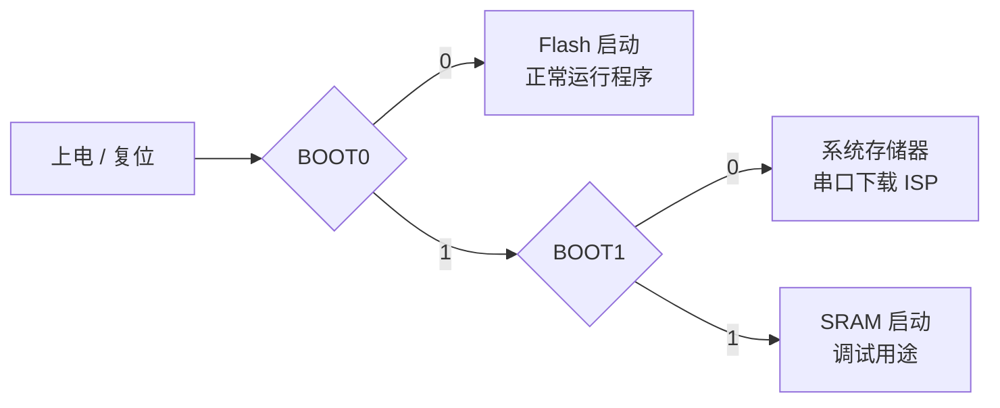

## 启动模式（BOOT0）

STM32 通过 BOOT0 引脚在上电/复位时选择启动方式。


| BOOT0 | 启动方式       | 说明                     |
| ----- | -------------- | ------------------------ |
| 0     | Flash 启动     | 正常运行用户程序（常用） |
| 1     | 系统存储器启动 | 串口下载程序（ISP）      |
| 1     | SRAM 启动      | 调试用途，极少使用       |

### 推荐接法
```
BOOT0 → 10kΩ → GND   // 默认从 Flash 启动
```

下载时将 BOOT0 拉高接 3.3V，复位后下载，完成后恢复接 GND。

### 何时需要 BOOT0 = 1

- 串口下载程序（ISP 模式）
- 芯片救砖（程序跑飞、调试器无法连接时）

:::note
BOOT0 = 0 → 正常运行 | BOOT0 = 1 → 下载 / 救砖
:::

---

## PCB 布线要点

### 晶振
无源晶振常有以下这种两脚插件封装和四脚贴片封装


无源晶振不需要供电，震荡依赖与芯片内部的震荡电路，自己不能产生时钟信号


有源为四脚贴片封装

有源芯片需要供一个电源，震荡不依赖与内部的震荡电路，有源晶振常常在电源上接入磁珠，防止晶振的一些高频噪声串到电源上


无源晶振频率受外接负载电容，杂散电容的影响，省率比较稳定，受外界参数影响小;
价格方面有源的比较贵，无源的便宜; 
:::caution
晶振外壳要接地
晶振走线尽量等长，底部铺铜层需挖空处理，避免寄生电容影响频率精度。

:::

---

## EDA 快捷键速查

> 软件：嘉立创 EDA（立创 EDA）
> `Ctrl + 右键` 可自定义任意快捷键

:::collapse[展开查看完整快捷键表]

| 功能                         | 快捷键      | 菜单路径                       |
| ---------------------------- | ----------- | ------------------------------ |
| 交叉选择                     | `Shift + X` | 设计 → 交叉选择                |
| 布局传递（需在原理图中选中） | `Shift + C` | 设计 → 布局传递                |
| 器件互换位置                 | `Shift + 3` | 布局 → 互换位置                |
| 元件区域分布                 | `Shift + 2` | 布局 → 分布 → 元件区域分布     |
| 器件翻面（顶底层切换）       | `L`         | 布局 → 翻面                    |
| 绝对偏移                     | `1`         | 布局 → 偏移 → 绝对偏移         |
| 线选                         | `2`         | 编辑 → 选择对象 → 接触到线条的 |
| 框选                         | `3`         | 编辑 → 选择对象 → 矩形内部     |

:::

## SWD电路
SWDIO  ──22Ω── MCU
          │
         10K
          │
         3.3V

SWCLK  ──22Ω── MCU

NRST   ──10K上拉到3.3V 
建议 swclk 和 swDIo接口加低电容TVS

usb-DM和USB_DP接22欧电阻串入io，帮助阻抗匹配，让通信更稳定

cc1和CC2下拉是取电，上拉是供电

NMOS选型：封装 vgsth:g s 之间的临界电压值，vgsth应该小于高电平的电压值，否则NMOS无法打开
 rdson ：等效电阻，越小越好
 cgs：g 和 s之间的寄生电容，影响打开速度

 Nmos箭头朝外（低电平熄灭 高电平打开）
 Pmos箭头朝里（低电平打开 高电平熄灭）
 https://www.bilibili.com/video/BV1Mb4y1k7fd?spm_id_from=333.788.videopod.sections&vd_source=b7d0192d380252a521f93935f54775c8