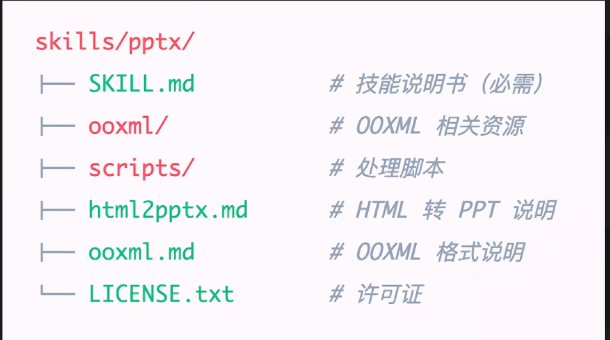
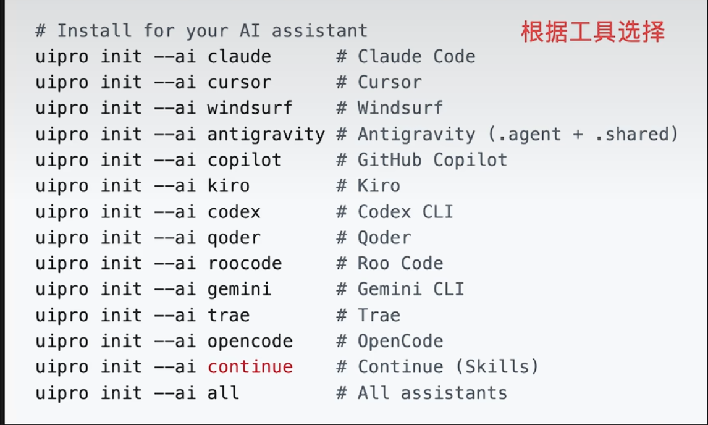

## 一、前言

目前对 Agent Skill支持最完善的工具是 Anthropic官方的Claude Code

以官方的PPT制作技能为例

image-1.png
第一部分是元数据
用yaml格式卸载文件开头
name是名字
description是技能的描述 描述写的越清晰 AI就越容易在合适的时机调用它
Agent Skill已经成为通用标准 cursor VS Code Codex等工具都支持
可以去Claude Skills Hub市场
开源的 Awesome Claude Skills等地方找到现成的技能

可以去github访问anthropic
https://github.com/anthropics/skills
github.com/openai/skills/tree/main/skills/.curated

.codex/
└── skills/
    └── your-skill-name/
        ├── SKILL.md
        │   **核心说明文件，定义 skill 的用途、触发条件和执行规则。**
        ├── agents/
        │   └── openai.yaml
        │       **元数据配置文件，用于定义 skill 的显示名称、简介、图标等界面信息。**
        ├── scripts/
        │   └── lint.sh
        │       **脚本示例，供 skill 在执行任务时调用。**
        ├── references/
        │   └── style-guide.md
        │       **参考资料示例，用于提供规则、规范或背景信息。**
        └── assets/
            └── checklist.md
                **资源文件示例，用于存放模板、清单或其他辅助材料**。

1. 先制定一个需求.md文档，在里面尽可能的描述一下工程的需求
2. 讨论细化需求 `注意本次对话我们要进行头脑风暴讨论，你可以阅读代码、文档等，但在我确认让你记录前，不要编辑任何文档。我现在在仿制一款蓝牙透传模块，需求.md文件中记录了此透传模块的一些功能。现在请你与我一同讨论这些功能，他们的作用、实现方式等。`
3. `嗯嗯，我们按顺序讨论，但是安全功能等都是要做的，我们用的芯片是ESP32-c2 相关资料你可以通过web search（网络搜索）查询`
4. prompt context（上下文）
明确需求与设计
制定详细执行计划
逐步按计划实施并自动测试
审查、验证与整合成果

## 实际案例
本次对话用于工程需求头脑风暴阶段。
你可以阅读项目代码、Reference 文件夹以及 still.md 文档以获取背景信息。
在我确认之前，不要修改或创建任何现有文档。

当前任务：

制定 需求.md 文档结构
梳理项目工程需求
通过代码、文档及 Web Search 补充需求信息

目标：
在不修改任何文件的前提下，完成需求分析并输出需求文档草案。

## 4. 工程开发约束
本工程由 STM32CubeMX 生成，并使用 Keil 编译。

开发过程中必须遵循以下规则：
1. 仅允许在 USER CODE BEGIN / END 区域内编写代码
2. 禁止修改自动生成代码
3. 禁止修改初始化函数
4. 禁止修改 .ioc 配置文件
5. 所有用户逻辑代码必须放入 USER CODE 区域
说明：当前环境会把 Markdown 里的文件路径识别为可打开资源，因此点击后可能会默认交给浏览器处理；这不是主动要求打开浏览器，而是宿主界面的默认行为。

# Codex 文件引用规则

为避免跳转浏览器，同时支持 IDE 内跳转，请统一使用：

文件路径:行号

示例：

APP/traffic_app.c:443  
Core/Src/main.c:26  
User/App/app_traffic.c:120

规则：

- 使用 文件路径:行号
- 不使用 Markdown 链接
- 不使用 file://
- 不使用 http://

目的：

支持 IDE 内跳转，不打开浏览器