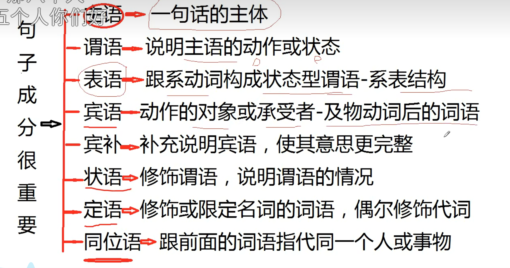
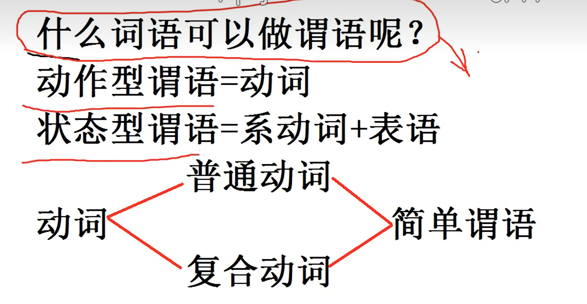

## 背景介绍
> 本人 02 年，高考英语 37 分，大学四级最高 330 分。  
> 这篇是我自己的应试提分笔记，不是系统教程。

## 总体思路
想学好考研英语，先搞清楚它考什么，然后只练会被考到的能力。  
应试和兴趣学习是两套逻辑（我这里只记应试）：

- 应试学习：强调针对性训练，目标是短期提分。
- 兴趣学习：强调长期积累，目标是语言能力提升。

我当前目标就是前者：先提分。

### 考研考什么
1. 完形填空
2. 阅读理解
3. 新题型阅读
4. 翻译
5. 小作文和大作文

本质上就两种能力：

- 阅读理解能力：对应 1、2、3、4。
- 写作表达能力：对应 5。

### ⭐ 第一部分：阅读
**基本方针：单词是基础，长难句是关键。**

#### 1. 单词
单词必须背，技巧不能替代词汇量。核心就一个词：**重复**。

无论你是背单词书，还是在真题里记单词，都要反复看、反复读。不要追求“一遍记住”，而是让单词在你每天的学习里持续出现。

不是一次性硬背，是让单词反复“刷脸”，直到看到就有熟悉感。

> 记一句话：重复越充分，记忆越深。


#### 2. 长难句

1. **陌生词处理**  
真题阅读里出现的不熟词，全部查出来，记到你的词汇本里，反复复习。

2. **难句处理**  
遇到看不懂的句子，按这三步走：
- 断句。
- 拆语法结构（主语、谓语、宾语、从句）。
- 手写翻译成通顺中文。

刚开始会慢，但这一步不能省。

3. **题目复盘**  
每道没完全吃透的题都要追根到底：
- 做对了，依据是什么？
- 做错了，误判点是什么？
- 为什么选 A，不选 B/C/D？
- 我的思路和解析差在哪里？

## 每篇阅读做完后要做什么

同一篇不要只做一遍。我的复读节奏：

1. 当天晚上读 2-3 遍。
2. 第二天早上读 2-3 遍。
3. 隔天再读 2-3 遍。
4. 一周后再读 2-3 遍。
5. 一个月后再读 2-3 遍。

### 为什么要复读？

复读至少有三个作用：

1. **重复记忆单词**  
在句子里记词，比脱离语境背词更牢。

2. **反复吃透长难句**  
提升读句速度和理解准确率。

3. **培养语感**  
慢慢适应英文表达和写作方式。

### ⭐ 第二部分：写作

#### 1. 基础尚可
从 9 月开始做作文专项：

1. 每周仿写 1-2 篇真题作文。
2. 对照范文，优化用词和句式。
3. 阅读中遇到好句型，及时整理并背诵。

#### 2. 基础薄弱
如果目前几乎写不出复杂句，就先用模板保底。从 10 月开始：

1. 按题型准备模板（小作文/大作文、常见话题）。
2. 背到可以不看提示直接默写。
3. 练习“替换词+替换句”，避免全篇僵硬套模。

先保证能拿分，再慢慢提上限。

### ⭐ 常见问题

#### 1. 单词书怎么选？
一本就够了，关键不是选书，而是重复。  
真题书我目前用的是：考研真相、考研圣经。

#### 2. 英语课怎么选老师？
这件事很主观。我觉得好的老师，不一定适合你。  
做法是：把主流老师都试听 1-2 小时，选最适合自己风格的。

#### 3. 要不要严格分阶段？
我自己的做法是不用分太细，核心就是每天做阅读。  
零基础的话，从现在到 11 月都保持阅读训练（一天一篇或两天一篇）。  
从 9 月开始，再加完形和新题型（每周 2 篇左右）。

## 推荐课程
- 刘晓燕：语法和长难句

## 语法
语法就是造句方法和规律

### 句子成分
主语 + 谓语 + 宾语 + 状语
主语 + 系动词 + 表语 + 状语
句子必须有动词，动词前面的通常是 主语 动词后面的名词是宾语 后面的副词 / 介词短语是状语
#### 第一节课（句子成分与基本类型）对复合句有很大的帮助
正确的方法 + 努力 = 成功

第一次：听课
第二次 看录像做笔记
第三次学时态回来复习
第四次学介词的时候回来复习
第五次 特殊疑问句
第六次 学从句的时候


复合句由简单句延伸出来的：主语，谓语 宾语 宾补
定语 状语

只要有名词就会有定语
基本上都会有状语

造句需要两个条件：1. 一个句子由几个部分构成。 2. 这些构成句子的各个部分的顺序或者位置

句子成分就是构成句子的各个部分。英语的句子成分总共七个：**主语 谓语 宾语 表语 补语 定语 状语** 还有一个不太重要的同位语
##### 主语
**主语就是一句话主要叙述的对象或者这句话主要讲的内容**，能充当主语的句子有：名词、代词、数词、动词不定式、动名词、句子、其它

**名词**都可以做主语，名词就是世间万物的名称，地名也是名词，看不见的也是名词：air wind voice
**人称代词/指示代词** 代词就是为了避免重复而代替名词的词语，代替人的代词就叫人称代词（有些人称代词也可以代指事物）
人称代词又分为**主格和宾格**主格和宾格都是指向同一个意思，只是作用不同
人称代词的主格只有：I we you she he it they  主格才可以作主语，宾语不可以
动词前面 → 主格
动词后面 → 宾格
this 和 that 是指示代词，也可以做主语

**数词**可以做主语，数词就是 1 2 3 4 5 6 7 8 9（基数词）或者 第一 第二 第三 第四 第五（序数词）不管是基数词还是序数词都可以作主语
**动词不定式/短语** 动词不定式和动名词都叫非谓语动词 动词原型是不能直接做主语的 **非谓语是非常重要的**
**句子**一个句子也可以做主语，做主语的句子我们就叫主语从句
**其他**有些词语看起来不是名词，但是具有名词的含义。比如，the old the poor the rich 形容词加上定冠词the就变成了名词
**能作主语的只有上面说的7个内容，其他一律不可以作主语,比如：谓语动词、形容词、介词、副词等都不可以作主语**
##### 谓语
谓语：说明了主语状态或者动作的词语：动作型谓语（说明主语做什么） 状态型谓语(说明主语是什么或者怎么样，系表结构)
**动作型谓语:**
动词：表示心理行为或动作的词语 like think play等等
1. 简单谓语(由实义动词/动词短语构成) 实义动词：表示有实际意义的动词
2. 动词短语就是由动词和另一个或几个单词构成的词组 如look after  listen to
一个实义动词或一个动词短语都可以构成简单谓语
>动词表
复合谓语就是由简单谓语在加上其他词语，共同作谓语的情况。主要有下面三种形式：
(1) 情态动词+实义动词或者动词短语的原型
(2) 助动词+实义动词或者动词短语的原型
(3) 助动词加其他动词形式

**状态型谓语:**
状态型谓语由 **系动词 + 表语**构成，从某种意义上来说这也是一种符合谓语
系动词主要由be充当 be有8形式 be am is are was were being been 
be 一般表示是的意思 有时候在中文中不翻译如：I am happy

**表语**其实属于谓语的范畴，但是不能说表语就是谓语，因为 **系动词 + 表语**才是谓语，说明主语怎么怎么样的就是表语，也可以说
说明表语情况或者说明主语状态的词语，总之系动词后面的词语就是表语，表语的定义不重要，重要的是什么词语可以作表语
**名词 形容词 介词短语 动词不定式 动名词 代词 数词 分词 副词 句子**都可以作表语

#### 第二节课：宾语、宾补和状语

##### 宾语
宾语是动作的对象或者承受者。英语的实义动词分为及物动词和不及物动词：

- 及物动词后面通常要带宾语
- 不及物动词后面不能直接带宾语，句意本身已经完整

能作主语的词，一般也能作宾语。只是人称代词作宾语时，要用宾格。

| 动词 | 及物用法 (vt) | 不及物用法 (vi) |
| --- | --- | --- |
| eat | I eat **apples**. | I eat at 7. |
| read | I read **books**. | I read every night. |
| write | She writes **letters**. | She writes well. |
| study | I study **English**. | I study at night. |
| cook | She cooks **dinner**. | She cooks every day. |
| drink | He drinks **coffee**. | He drinks a lot. |
| sing | She sings **a song**. | She sings well. |
| drive | He drives **a car**. | He drives very fast. |
| play | They play **football**. | The children are playing. |
| run | He runs **a company**. | He runs every morning. |
| open | She opens **the door**. | The door opened. |
| close | He closed **the window**. | The shop closes at 9. |
| start | We start **the meeting**. | The meeting started. |
| stop | She stopped **the car**. | The car stopped. |
| change | He changed **his job**. | The weather changed. |

常见宾语形式：

- 名词：`I buy a book every year.`
- 代词宾格：`I believe her.`
- 数词：`I want two.`

##### 双宾语
有些及物动词后面可以跟两个宾语：

- 间接宾语：通常指人
- 直接宾语：通常指物

基本结构：

`主语 + 双宾动词 + 间接宾语（人） + 直接宾语（物）`

例如：

- `I gave her a book.`
- `I gave him a book.`
- `I gave Jack a book.`

这两个宾语的位置也可以换，但如果把间接宾语放到后面，前面一般要加 `to` 或 `for`：

- `I gave a book to her.`
- `She lent her bike to me.`
- `They sent a gift to her.`

能带两个宾语的及物动词称为双宾动词，常见的有：

`give` `buy` `lend` `send` `teach` `tell` `show` `sing` `write` `offer` `leave` `prepare`

##### 宾语补足语
有些动词加上宾语以后，意思还是不完整，还需要再加一个成分来补充说明宾语，这个成分就叫宾语补足语，简称宾补。

常见能带宾补的动词：

`make` `let` `get` `have` `find` `call` `see` `keep` `put`

宾补只和宾语有关，而且一定放在宾语后面。

能作宾补的词语有：

- 形容词
- 名词
- 数词
- 动词不定式
- 动名词
- 副词
- 分词
- 介词短语
- 句子

1. 形容词作宾补

- `I made her happy.`
- `You make me mad.`
- `She made him upset.`
- `Eating apples can make you healthy.`

2. 名词作宾补

- `I call her Mary.`
- `You can call me Nick.`
- `I will make her a happy woman.`

名词作宾补时，容易和双宾语混淆。最简单的判断方法是：看宾语和后面的词是不是同一个人或同一件事。

- `I call her Mary.` 中，`her = Mary`，所以 `Mary` 是宾补
- `I gave her a book.` 中，`her ≠ book`，所以这是双宾语

对比：

```text
宾补
I make you happy.
you = happy

双宾语
I give you a book.
you ≠ book
```

3. 数词作宾补

- `I put my career first.`
- `I put my family first.`

##### 状语
状语就是说明谓语情况的成分，主要和谓语有关。常见的有：

- 时间状语
- 地点状语
- 方式状语
- 原因状语
- 目的状语

状语一般由副词或介词短语来充当。

例如：

- `I teach English in Guangxi.`
- `I teach English in Beijing.`
- `We work in Guangxi.`
- `I am happy today.`
- `I am busy now.`
- `I will buy a book tomorrow.`
- `I teach English here.`
- `She is watching TV upstairs.`
- `I speak English slowly.`
- `She reads English loudly.`
- `She looked at him angrily.`

##### 多个状语的位置规则
英语一句话里可以同时出现多个状语。对初学者来说，先记最常见的顺序就够了：

`方式 + 地点 + 时间`

例如：

- `He spoke English slowly in class yesterday.`
- `She did her homework carefully at home last night.`
- `I teach English in Guangxi now.`

如果状语里有频度副词，比如 `often` `usually` `always` `sometimes`，位置会更特殊一些：

- 频度副词一般放在实义动词前：`I usually go home after work.`
- 放在 be 动词后：`He is often busy after school.`

为了强调时间或地点，也可以把某些状语提前：

- `Yesterday, I bought a book in Beijing.`
- `In Guangxi, I teach English now.`

先掌握最常见的顺序，不要一开始就把所有特殊情况混在一起。

总结：

- 宾语 = 动作的对象或承受者
- 双宾语 = 间接宾语 + 直接宾语
- 宾补 = 补充说明宾语的状态、身份或结果
- 状语 = 说明动作或状态发生的时间、地点、方式、原因、目的等情况

#### 第三节课：定语
定语:修饰或限定限定名词的词语叫定语，定语大多数和名词有关(也可以修饰代词，比较复杂)(哪里有名词哪里就有定语)
注意：在英语里面，普通名词才能带定语，一般情况下，专有敏次不能带定语的，除非特殊情况
在英文里面也有放在前面的定语，叫前置定语，另外，还有后置定语，就是放在名词后面修饰前面的名词的定语
中文没有后置定语的概念
在英语里面能作前置定语的有：形容词性物主代词，形容词，名词所有格('s)、数词、名词、量词、指示代词
形容词性物主代词作前置定语：`**my** book` `**her** pen`  `**our** teacher`
形容词作前置定语：`**expensive** book` `**good** book`
名词所有格作前置定语：`**Nick's** house`
数词作前置定语：`**three** books` `**Ten** apples`
名词作前置定语：`**English** book` `**room** number`
量词作前置定语：`**a bottle of** water`
指示代词作前置定语:`**this** bok`

注意：同一个普通名词，可以跟多个定语：`**Two beautiful** girls`
后置定语由介词短语、名词所有格（of + 名词）、动名词短语、动词不定式短语、句子构成。
如：The people in the park are dancing
#### 同位语
同位语的意思就是，两个不同的词语都表示同一个人或事物，同位语起强调补充的作用
例：my father ,the fat man,is drinking.
解释身份 → 同位语
产生身份 → 宾补

如果是动词造成 → 宾补
如果只是解释身份 → 同位语

#### **五个基本句型**
1. 主语 + 谓语（不及物动词） +  状语（表示动作）
2. 主语 + be(系动词) + 表语 + 状语（表示状态）
3. 主语 + 谓语(及物动词) + 宾语 + 状语
4. 主语 + 谓语（及物动词里面的双宾动词）+ 双宾语 + 状语（表示动作）
5. 主语 + 谓语（极少数特定的及物动词） + 宾语 + 宾补 + 状语（表示动作）
也可以分为两个基本句型
1. 状态型：主语 + （系）be + 表语 + 状语
2. 动作型：主语 + 谓语 + 宾语 + 状语
我们造英文的句子，首先要做的是选择正确的句型，之后才是时态，词语等等
一个动作的句子是没有be动词的

#### 句子成分复习课一

什么能作主语：
1. 名词（所有名词都可以）
Nick is a teacher
Guangxi is a beautiful
the man is strong
2. 人称代词主格
I am a teacer
she is beautiful
3. 指示代词 （That this）
  this is 
4. 动词不定式短语（非谓语动词短语）
5. 动名词（短语非谓语动词短语）
6. 其他（相当于名词或起到名词作用的词语）
7. 句子（主语从句）

谓语

复合动词 = 动词短语/动词词组 ： `get up`  `look after`
一个普通动词或复合动词都可以做简单的动作型谓语
#### 句子成分复习课二
宾语非常简单=及物动词后面的词语
能做宾语的词语和能做主语的词语一致
注意下:做宾语的代词必须用代词宾格就可以了，还有做宾语的句子叫做宾语从句
:名词，代词宾格，动词不定式短语，动名饲短语，句子，数词(极少)，其他(相当于名词或起到名词作用的词语)
   I like Nick (人名)

   I like Guangxi (地名)

   I like the girl (普通名词)

   I like them (人称代词宾格)

   I like swimming (动名词或短语)

   I like to study (动词不定式或短语)

宾补说白了，就是宾语不够用，需要其他词语支援。然后不是所有的宾语后面都可以有宾补，这个要看及物动词的情况，规则比较麻烦，而且能做宾补的词语也很多，规则也很多，初学者先不纠结，总之简单记下能做宾补的词语有:形容词，名词，数词，动词不定式，动名词，副词介词短语等等
### 名词
名词的分类：
普通名词 普通名词 = 表示一类人、一类事物、一类地点的名称
专有名词 专有名词 = 人名、地名、专有机构、组织、节日、术语等名称

普通名词又分为 可数名词 和 不可数名词
可数名词就是那些肉眼能分清数量的名词，不可数名词则相反
可数名词都有两种格式：一个是单数的格式 一个是复数的格式
元音：`a` `e` `i` `o` `u`
辅音：除了元音之外的字母
一般 +s  
s x ch sh o → +es  
辅音+y → ies  
元音+y → +s  
f/fe → ves  

复数形式
│
├ ① 以 s 结尾
│     → 去 s
│
│     books → book
│     apples → apple
│     students → student
│
├ ② 以 es 结尾
│     → 去 es
│
│     buses → bus
│     boxes → box
│     watches → watch
│     dishes → dish
│
├ ③ 以 ies 结尾
│     → ies 变 y
│
│     cities → city
│     babies → baby
│     families → family
│
├ ④ 元音 + ys
│     → 去 s
│
│     boys → boy
│     toys → toy
│     days → day
│
└ ⑤ 以 ves 结尾
      → ves 变 f / fe

      leaves → leaf
      knives → knife
      wolves → wolf
      wives → wife
特殊单独记

不可数名词是单数概念，所以作主语的时候，后面的谓语动词要考虑变单数格式
#### 量词
量词作前置定语
例子：
`two cups of tea /coffee`
`a bottle of milk /wine /oil`
量词的构成方式有两种:
1. A/an/one + 可数名词单数 + of
例如： a cup of 一杯
a bucket of 一桶
A tin of 一罐 
2. 数词 + 可数名词的复数 + of
例如 ： two bottles + of
three tins of 
注意：量词里面的of是没有意思的
量词可以修饰可数名词的复数，但是不能修饰单数
例如：`a basket of apples`
`a box of books`
量词只有两种用法：作定语，修饰不可数名词和修饰可数名词复数

注意：不是所有的可数名词，都能构成量词，只有那种有内部空间或容器或者一些符合逻辑
比如：bag/basket/truck
cip glass bottle
bar piece loaf

量词虽然可以可以修饰可数名词的复数，但是不常见

**注意：一个可数名词的单数是不能单独在句子或短语里面出现的，需要加限定词，或者加冠词，或变复数**
冠词不是限定语它是特殊的限定词

#### 名词的作用
1. 做主语
2. 做宾语
3. 作表语 名词作表语是说明主语的身份
4. 名词作介词宾语
5. 名词作同位语
名词 + 名词结构
前面的名词通常不用复数
后面的名词决定复数变化

课后作业，写出8个量词，并且写出量词的中文意思

#### 名词所有格
名词所有格是表示所属关系的一种格式
人名 + 的 = 所有格 作定语
名词所有格一般作前置定语，修饰名词
还可以作表语：例子：Whose pen is it
如果名词是`s` 结尾的复数或名词本身是`s` 结尾的，直接加`'` 就可以了了，当然也可以加`s`
用of + 无生命
### 代词 
I you she, he they we it
Me you her him them us it
物主代词
My Mine
### 形容词
good busy tired Rich poor
形容词做定语要加冠词如：Nick is a strict teacher 
### 动词
谓语动词
非谓语动词
实义动词： learn teach eat write
系动词：be = is,are,am,was
助动词:do does will
情态动词:can must
### 冠词
the an/a
### 一般现在时
主系表
主谓宾
一般疑问句
否定句
### 一般过去时
### 一般将来时

会造简单句之后就可以学习音标了

### 复习四个基本时态
### 副词
时间副词
### 介词
In on at
### 词汇搭配
动词不定式

### 短文精读
### 现在完成时
### there be 句型和情态动词
在短文中经常出现这种句型
### 特殊疑问句
Why do you love me?
What do you do?
Where are you learning English?
### 动词不定式短语
To learn English
### 动名词短语
### 被动语态
### 做作业
入门班的作业，先写简单的，第二遍在写复杂一点的，通过简单的单词造简单的句子，熟悉语法基本规则，一步步掌握综合思维，翻译中文是老问题了
学太快，和学太慢都不行，要根据自己的情况，根据作业的情况做调整

## 入门第一课
语法->单词->阅读->写作->听力->口语
用造句去学习语法和单词
## 如何长期坚持英语（至少坚持两年）
打卡 ：3月5日
3月7日


## 英语每日打卡专栏

> 用于每天记录学习内容和复盘结果。

### 专栏使用方式
- 每天填 1 次，不求完美，重点是连续性。
- 每周末做 1 次周复盘，调整下周计划。

### 每日打卡模板
- 日期：`YYYY-MM-DD`
- 学习总时长：`__ 分钟`
- 今日任务完成度：`__ / 5`
- 今日完成：
  - [x] 单词
  - [x] 阅读
  - [ ] 长难句
  - [ ] 写作
  - [ ] 错题复盘
- 今日最大收获：`_____`
- 今日最大问题：`_____`
- 明日计划：`_____`
